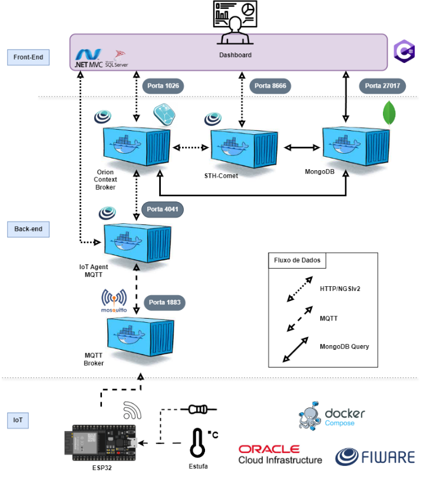

# Docker

Esta pasta contém todos os arquivos e explicações relacionadas ao ambiente 
Docker.

## Índice

1. [O Ambiente Docker](#o-ambiente-docker)
2. [Editando o Arquivo env](#editando-o-arquivo-env)
3. [Observações](#observações)

## O Ambiente Docker

Para executar o ambiente Docker configurado desse projeto, você precisará de um 
servidor com arquitetura `ARM64/V8` com no mínimo 1 núcleo, 1GB de RAM e 20GB de 
armazenamento, o Docker e o Docker Compose instalados. Para os nossos testes, 
utilizamos uma instância da Oracle Cloud com um processador Ampere a1, com 4 
núcleos, 24GB de RAM e 200GB de armazenamento.

Os componentes e suas versões utilizadas no ambiente Docker:
- `MongoDB (7.0.9)`: Banco de dados NoSQL para armazenar dados do sistema.
- `Orion (3.10.1)`: Plataforma de IoT para gerenciar e contextualizar dados dos 
dispositivos.
- `STH-Comet (2.10.0)`: Broker de mensagens que facilita a comunicação entre os 
componentes do sistema.
- `Eclipse Mosquitto (latest)`: Broker MQTT para comunicação entre o ESP32 e o 
Orion.
- `IoTAGENT-ul (2.4.2)`: Agente de IoT que coleta dados do ESP32 e os envia 
para o Orion.
- `Azure SQL Edge (latest)`: Banco de dados relacional para armazenar dados 
específicos do sistema MVC.

Abaixo um diagrama representando as conexões desses containers com o ESP32 e o 
dashboard ASP.NET

Veja o diagrama das conexões

Para uma visão mais simplificada do funcionamento, verifique a documentação 
principal do projeto no tópico `Como Usar` itens 1, 2 e 3.

## Editando o Arquivo env

Como já explicado no arquivo da documentação principal, as variáveis que temos 
que alterar no arquivo `.env` são:
- `MONGO_USER` e `MONGO_PWD` para o usuário e senha do MongoDB.
- `MSSQL_PWD` para a senha do SQL Server (o usuário padrão é "sa").

Você também pode alterar as portas padrão dos componentes se desejar. As portas 
padrão são:
- `MONGO_PORT`: 27017
- `ORION_PORT`: 1026
- `STH_COMET_PORT`: 8666
- `MOSQUITTO_PORT_1`: 1883
- `MOSQUITTO_PORT_2`: 9001
- `IOT_AGENT_PORT`: 4041
- `MSSQL_PORT`: 1433

## Observações

- A pasta `mosquitto` contém o arquivo de configuração `mosquitto.conf` para o 
broker MQTT. Este arquivo não precisa ser alterado.
- As portas padrão dos componentes são as portas externas que você usará para 
acessar os serviços. Internamente, os containers se comunicam nas portas padrão.
