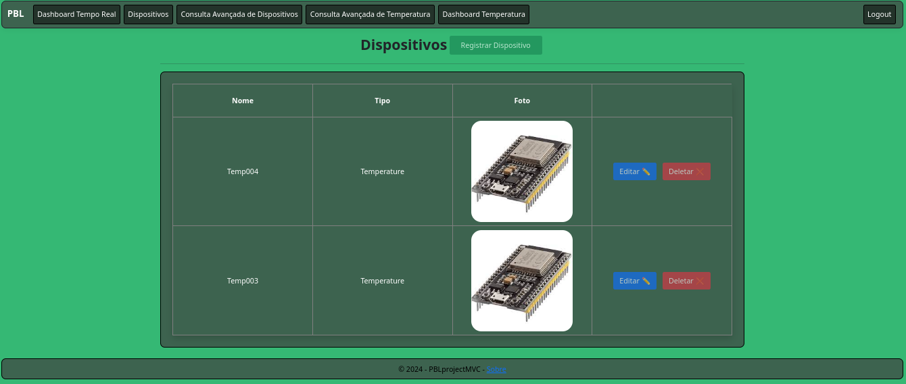

# Intuito do Sistema MVC

Para a facilitação e exemplificação de uso dos dados coletados pelo desenvolvimento ao redor do ESP32, foi também desenvolvido este sistema ASPNET core MVC para uma melhor representação em telas, além da demonstração do controle de acesso aos serviços ofertados pelo FIWARE

## Telas

As telas deste sistema são divididas em dois principais escopos:

### Telas Comuns

As telas comuns são aquelas que, ao estar configurado e executado corretamente o sistema, podem ser acessadas por qualquer indivíduo para visualização de dados adquiridos, para a aquisição de um login e tela "Sobre".

#### Tela Principal


#### Tela de Aquisição de Login


#### Tela Sobre


### Telas para Usuários Logados

Além de todos os aspectos mostrados pelas telas comuns, usuários logados podem transitar entre telas de dispositivos e de pesquisas mais avançadas para melhor aquisição de informações sobre os sistemas que realmente fornecem os dados para as analises mostradas.

#### Tela de Dispositivos



#### Tela de Consulta Avançada


#### Telas para Admins

Somado a todas as funcionalidades anteriores, usuários admins podem fazer edições de dispositivos, além do gerenciamento dos usuários do sistema, cada ação com sua respectiva tela.

##### Tela De Gerenciamento de Usuários


##### Exemplo de Tela de Edição


## Configuração do Sistema MVC de Controle de Temperatura

Para que o funcionamento do sistema MVC de controle de temperatura funcione é necessário que seja feito:

Uma adição no repositório base do projeto de um arquivo `config.json` com o seguinte formato:

```json
{
    "ConnectionStrings": {
        "DefaultConnection": "Data Source=<IP de onde está localizado o banco de dados>; Database=<Nome da database a ser utilizada, já existente no banco>; user id=<Usuário a ser logado na autenticação SQL Server>; password=<Senha para autenticação do Usuário>"
    },
    "Host" : "<host onde está localizado o FIWARE>"
}
```

## Exemplo de `config.json`

```json
{
    "ConnectionStrings": {
        "DefaultConnection": "Data Source=192.168.1.100; Database=ControleTemperatura; user id=admin; password=senha123"
    },
    "Host" : "192.168.1.100"
}
```

Para configuração de host do FIWARE e string de conexão do banco de dados.

### Usuário Admin

Também se faz necessário que, pelo menos, um usuário seja classificado como um administrador, privilégio dado pela alteração direta no banco de dados de um usuário já criado através do próprio sistema MVC.
