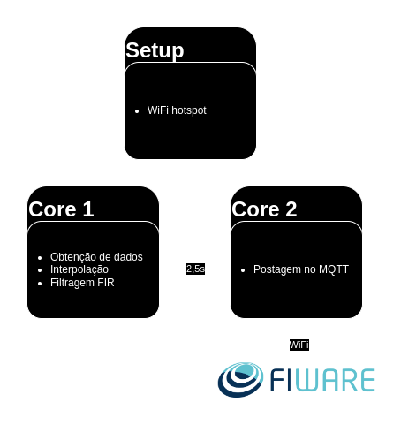
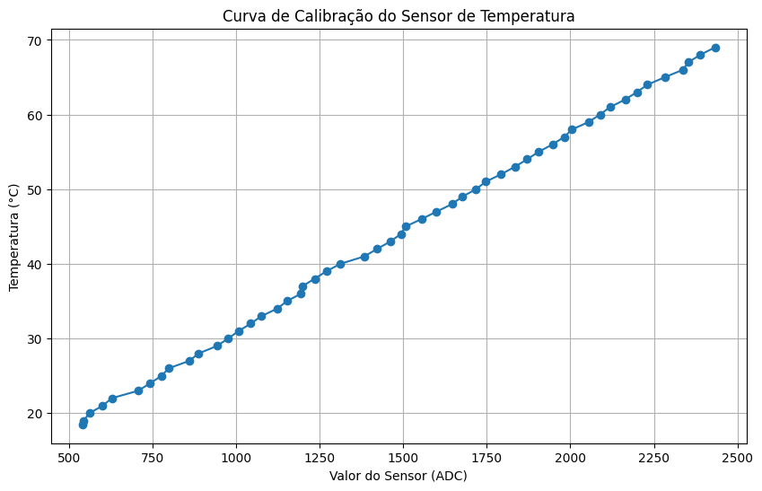
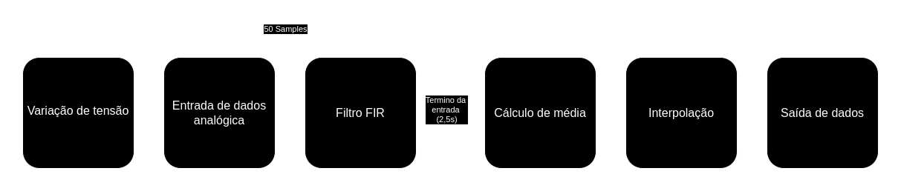
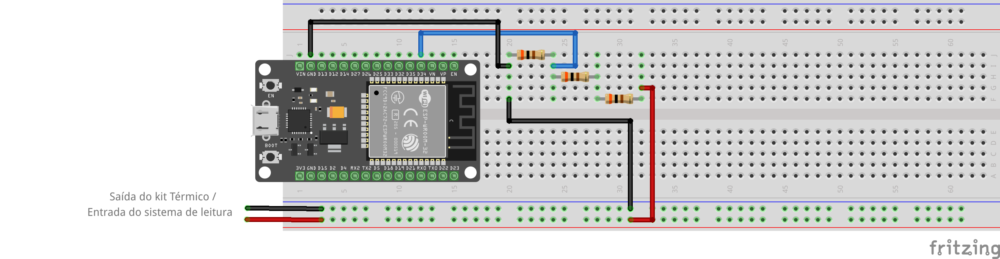
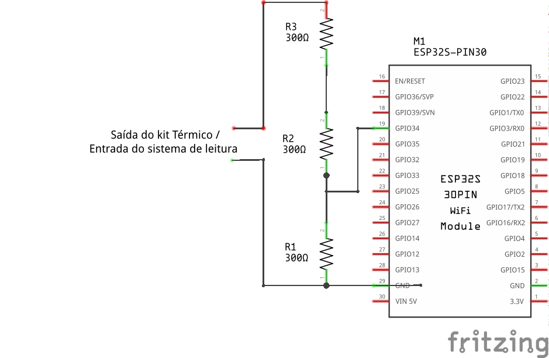

# Sketch

Esta pasta contém todos os arquivos e explicações relacionados ao funcionamento 
do código do ESP32.

## Índice

1. [Funcionamento](#funcionamento)
    1. [Setup](#setup)
        - [Configuração Inicial](#configuração-inicial)
        - [Conexão MQTT](#conexão-mqtt)
    2. [Núcleos](#núcleos)
        - [Leitura Analógica e Interpolação da Temperatura](#leitura-analógica-e-interpolação-da-temperatura)
        - [Envio de Dados](#envio-de-dados)
2. [Especificações técnicas](#especificações-técnicas)
    1. [Materiais utilizados](#materiais-utilizados)
    2. [Montagem](#montagem)
    3. [Diagrama](#diagrama)

## Funcionamento

Todo o funcionamento do sistema criado para o ESP32 é baseado na configuração do 
WiFi no Setup e na divisão de tarefas nos núcleos, onde o primeiro núcleo é 
responsável pela obtenção de dados e o segundo núcleo pela postagem desses dados 
no tópico MQTT. Abaixo, um diagrama que exemplifica a lógica utilizada no ESP32:

Veja o diagrama da divisão de núcleos

### Setup
****

#### Configuração Inicial

O ESP32 é configurado para se conectar à rede WiFi local usando o WiFiManager, o 
que permite que o usuário selecione a rede e insira a senha por meio de um 
hotspot criado pelo ESP32.

O hotspot genérico criado tem o nome de `PBL-GN3`, e a senha de acesso é 
`password`. Caso queira mudar esses parâmetros, basta alterar o arquivo 
`WiFi.cpp`.

#### Conexão MQTT

O ESP32 se conecta ao servidor MQTT do Fiware usando o endereço IP e a porta 
definidos no arquivo `config.hpp`. Ele também define os tópicos de subscrição e 
publicação.

### Núcleos
****
#### Leitura Analógica e Interpolação da Temperatura

O ESP32 lê, por meio da porta analógica `TEMPERATURE_PIN` definida no arquivo 
`config.cpp`, a tensão de saída do kit, que varia de acordo com a temperatura 
interna. São realizadas 50 leituras em intervalos regulares de 50ms, aplicando 
um filtro FIR para suavizar as leituras.

Os valores analógicos lidos são interpolados linearmente com base em uma tabela 
de valores de referência, onde o valor analógico é transformado na temperatura. 
Isso permite obter uma medição mais precisa da temperatura ambiente.

Para calibrar com os valores do kit, fizemos um programa simples onde pegávamos 
o valor analógico da entrada a cada 1s e relacionávamos com a temperatura 
mostrada no visor do kit. Com isso, conseguimos um intervalo de interpolação 
para os valores lidos. Abaixo, a curva de calibração do kit utilizado:

Veja a curva de calibração do kit

&nbsp;

Todo esse processo de obtenção da temperatura pode ser visualizado de maneira 
mais simples no diagrama abaixo:

Veja o diagrama de obtenção da temperatura

#### Envio de Dados

Após a leitura e interpolação feitas no primeiro núcleo, o ESP32, por meio do 
segundo núcleo, envia os dados de temperatura para o servidor MQTT do Fiware, 
que os armazena e os torna disponíveis para análise e visualização na plataforma 
Fiware.

## Especificações técnicas

O funcionamento elétrico do circuito é de fácil entendimento. A saída do kit 
térmico/entrada do sistema de leitura gera uma tensão máxima de 10V, que é 
dividida entre 3 resistores de 300Ω. Logo, cada resistor terá uma carga máxima 
de 3.3V, que é o máximo de tensão que o ESP32 suporta em suas entradas 
analógicas. Portanto, pegamos a tensão de apenas um resistor para ter uma escala 
direta entre 3.3V e 10V.

### Materiais utilizados
| Quantidade | Componente            |
|------------|-----------------------|
| 1          | DOIT Esp32 DevKit v1  |
| 3          | Resistor (300Ω)       |

### Montagem

Veja a montagem

### Diagrama

Veja o diagrama elétrico

